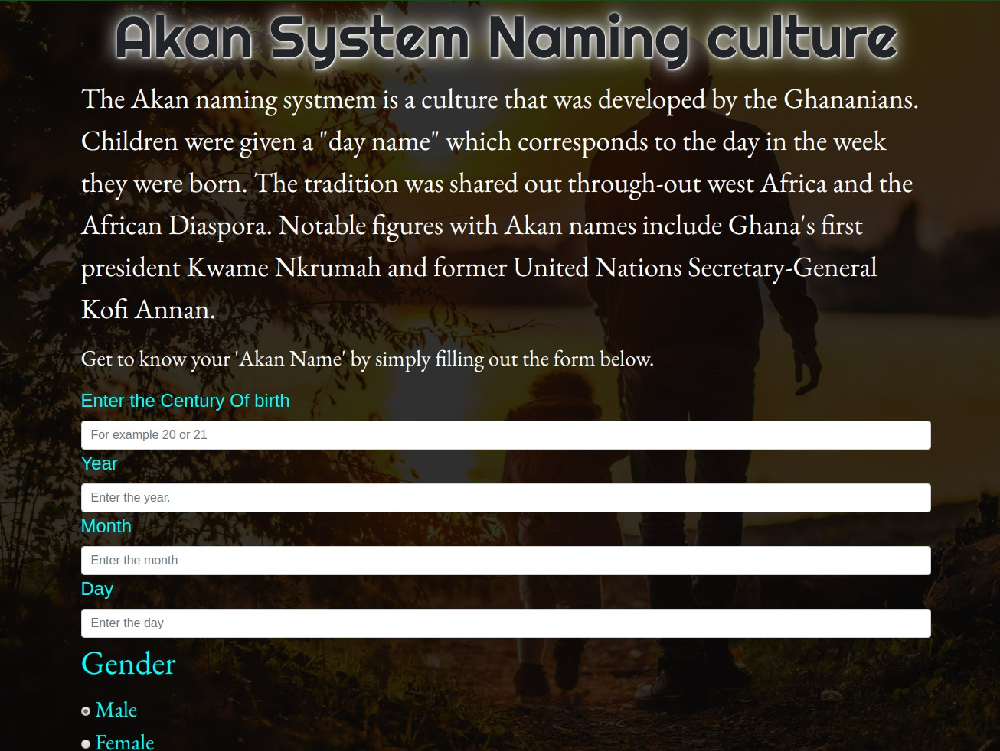

## Table of Contents

- Project Title
- Description
- Deployment
- BDD (Behaviour Driven Development)
- Project Screenshot

# AKAN NAMING SYSTEM

## DESCRIPTION

- This is a website that was inspired by the Ghananian way of determining `new-borns's first name`. Just by adding your `birthday date` , the site calculates the `day of the week` you were born and then depending on their gender outputs their Akan Name.

## Deployment

- You can vist the site directly by clicking [HERE](https://skimanikings.github.io/Akan-Names/)
- To view the source codes on github click [HERE](https://github.com/SkimaniKings/Akan-Names)

## BDD

> The website will require a user to fill out information about his date of birth and the century he was was born.
> The application calculates the day of the week the user was born and outputs it.
> One will be required to choose his gender and then click on the submit button in order to generate his/her Akan name.
> The application matches the day of the week with a specific Akan Name and outputs it to the user with a personalized message.

- NB : `All input should be in Numbers`

## Project Screenshot

